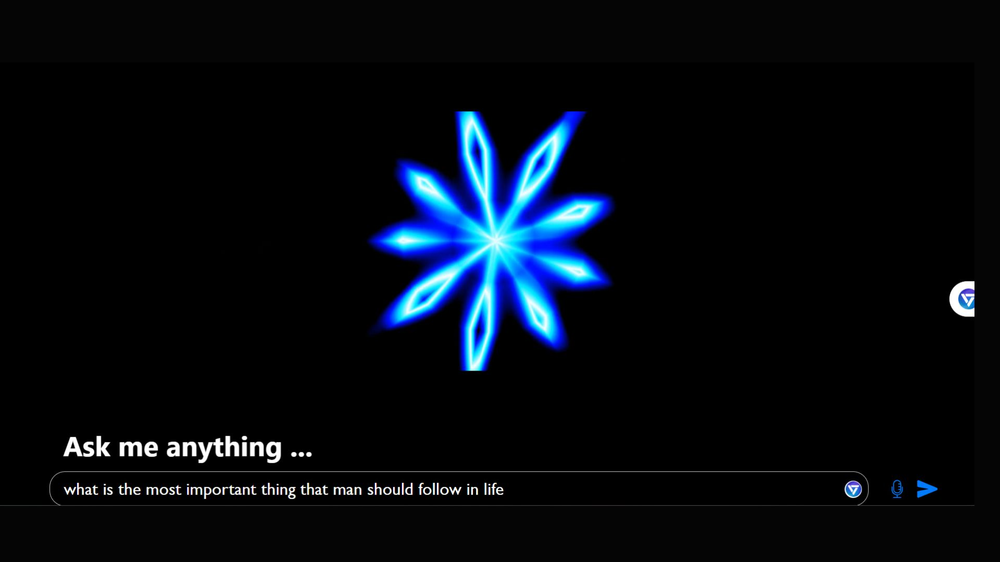
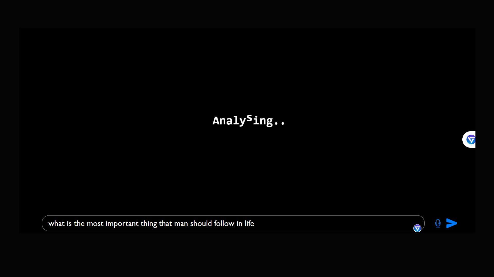
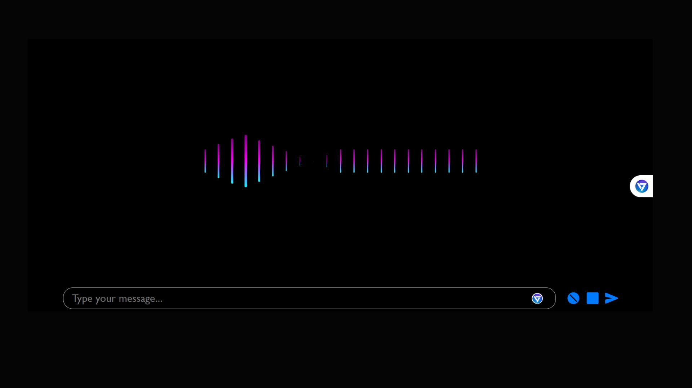
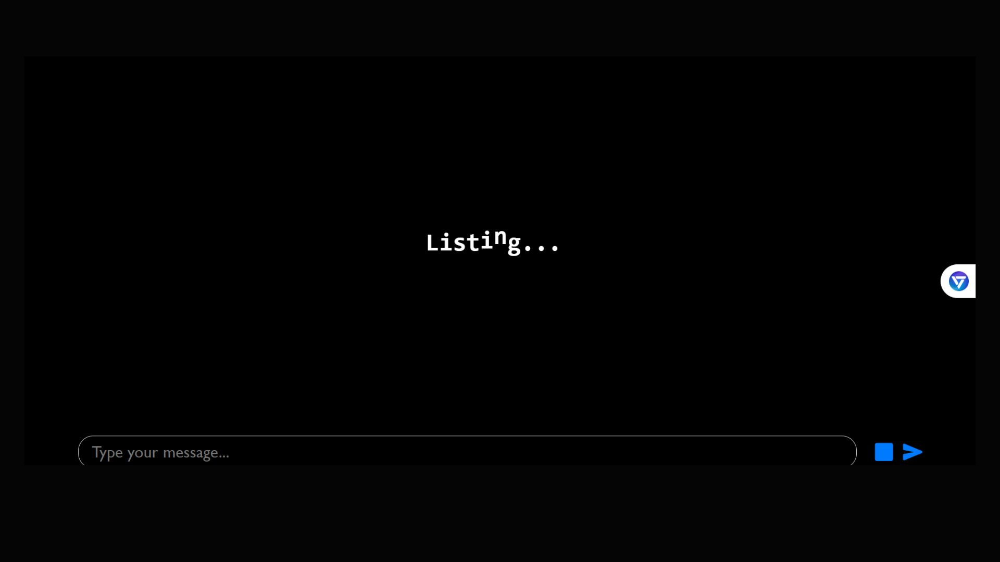

# Voice-Based Personal Assistant

This project is a Voice-Based Personal Assistant application built using React. The assistant can process both text and voice commands, opening various applications or performing searches. It utilizes a generative AI model for answering questions. The backend implementation can be found [here](https://github.com/chandankumarm55/Boat-backend).

## Features

- **Voice Recognition**: The assistant can listen to your voice commands.
- **Text Commands**: You can type your commands if you prefer not to use voice.
- **Open Applications**: It can open various applications like Google, YouTube, Facebook, Calculator, Notepad, Paint, Command Prompt, File Explorer, and Settings.
- **Generative AI**: For any other queries, it uses a generative AI model to provide answers.
- **Speech Synthesis**: The assistant can read out responses.

## Getting Started
## Screenshots







### Prerequisites

- Node.js and npm installed
- A browser that supports the Web Speech API

### Installation

1. Clone the repository:

```bash
git clone https://github.com/chandankumarm55/Voice-Based-Personal-Assistant.git
cd Voice-Based-Personal-Assistant
```
2. Install dependencies:
```bash
npm install
```
3.Set up the backend:
Follow the instructions in the Boat-backend repository to set up the backend and generate your API key from gemini api key.

4.Create a .env file in the root of your project and add your API key:
```bash
API_KEY=your_api_key_here
```
5. Running the Project
Start the development server:
```
bash
npm start
```
Usage
Voice Commands: Click the microphone icon (CiMicrophoneOn) to start speaking. Click the stop icon (FaStop) to stop.
Text Commands: Type your command in the input field and press the send icon (IoSend).
Supported Commands
Open Google: Opens Google in a new tab.
Open YouTube: Opens YouTube in a new tab.
Open Facebook: Opens Facebook in a new tab.
Open Calculator: Opens the Calculator app.
Open Notepad: Opens the Notepad app.
Open Paint: Opens the Paint app.
Open Command Prompt: Opens the Command Prompt.
Open File Explorer: Opens the File Explorer.
Open Settings: Opens the Settings.
Custom Searches
If the command does not match any of the above, the assistant will perform a Google search with the provided query.

